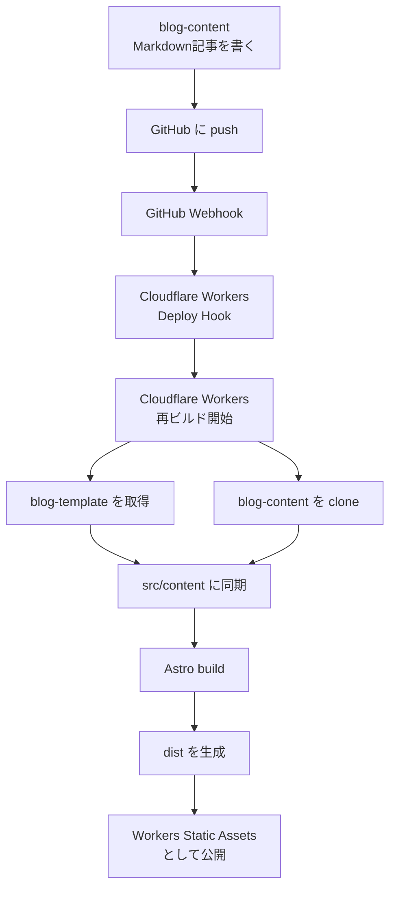

`takuyaw-w.dev` というドメインを持っていたものの、ほとんど活用できていなかった。

ブログを作ろう、作ろうと思いつつ、なかなか重い腰を上げることができずにいたが、AIの力を借りて、ようやくブログのテンプレートを作成できた。

本来はコンテンツに集中したい。
それなのに、ブログの見た目や仕組み、ホスティング、記事管理のような、本質ではない部分に気を取られることにストレスを感じていた。

これでようやく、書くことに集中できるようになった気がする。

## 何を書くのか

ブログの内容は、たぶん雑記になると思う。

最近は読書にハマっているので、読書の内容をまとめることが多くなるかもしれない。
今まで読書メモはほとんどしていなかった。読み終わった直後は覚えていても、しばらくすると細部はどんどん抜けていく。

読んだ内容を忘れないようにするためにも、読書メモをブログに残していきたい。

技術メモも書く。
開発中に詰まったこと、調べたこと、作ったもの、判断に迷ったことなども置いていく。

## 技術構成

技術的な話をすると、このブログテンプレートは Astro で作成している。
ホスティングには Cloudflare Workers を使っている。

より正確には、Astroで静的にビルドした `dist` を、Cloudflare Workers Static Assets として配信している。

構成としては、テンプレートとコンテンツを分けた。

- blog-template
  - Astro本体、レイアウト、CSS、ビルド設定
- blog-content
  - Markdown記事、About、Projects、画像

同じリポジトリにまとめることもできたが、テンプレートとコンテンツが混ざると、後から分離しづらいと感じた。
記事を書きたいだけなのに、テンプレート側の都合を意識し続けるのは避けたかった。

リポジトリを分けておけば、最悪テンプレートはいつでも捨てられる。
コンテンツさえ残っていれば、別のテンプレートや別の仕組みに載せ替えられる。

## PagesからWorkersへ

最初は Cloudflare Pages で公開していた。

静的ブログとしては Pages でも十分だったし、実際に問題なく動いていた。
ただ、Cloudflareの現在の流れとしては、静的アセットも Workers 側で扱えるようになっており、今後は Workers を中心に考えた方がよさそうだと分かった。

この点は、同僚のDさんに教えてもらった。
Workers Static Assets の方が今後の構成として自然だと教えてもらえたので、そこから Workers 移行を進めた。感謝している。

とはいえ、今回のブログではSSRは使っていない。
Astroはこれまで通り静的生成のままにしている。

つまり、構成としてはこうなる。

- Astroで静的サイトを生成する
- `dist` を作る
- `wrangler deploy` でWorkers Static Assetsへアップロードする
- Workers上で静的資源として配信する

WorkerでリクエストごとにHTMLを生成しているわけではない。
あくまで、静的資源の配信先を Pages から Workers に移しただけである。

## どうやって合成しているか

テンプレートとコンテンツの合成は、Cloudflare Workers のビルド処理で行っている。

Cloudflare Workers側には `blog-template` のリポジトリを紐づけている。
`blog-template` が更新された場合は、そのまま Workers のビルドが走る。

一方で、記事は `blog-content` 側で管理している。
記事を更新して `blog-content` に push すると、Webhook 経由で Cloudflare Workers の Deploy Hook を叩く。

すると、Cloudflare Workers が `blog-template` を再ビルドする。
そのビルド中に `blog-content` を clone し、テンプレート側の `src/content` に同期する。

その上で Astro がビルドされ、最終的に生成された `dist` が Workers Static Assets として公開される。

ざっくり言うと、こういう流れになる。

そして今、このブログが公開されている。

## なぜテンプレートとコンテンツを分けたのか

なぜここまでして、テンプレートとコンテンツを分けたのか。

一番大きい理由は、文章を自分の手元に置いておきたかったからだ。

世の中には、はてなブログや note のような便利なブログサービスがある。
もちろん、それらはそれらで良い。すぐ書けるし、管理も楽だ。

ただ、そういったサービスでは、テンプレートとコンテンツが完全には分離していない。
場合によっては、Markdownで書くことや、Markdownとして出力することが十分にサポートされていないこともある。

自分が書いた文字が、自分が書いた文章が、どこかのサービスのどこかのサーバーに保存される。
それ自体は普通のことではある。

でも、コンテンツの所有者は誰なのか。

私である。

私が書いた文章は、私のものであるべきだ。

だから、テンプレートとコンテンツを分けた。
文章は Markdown として Git で管理する。テンプレートはその文章を表示するための仕組みとして扱う。

保存先として GitHub を利用しているので、完全に自分の手元だけで完結しているわけではない。
ただ、GitHub はある種のストレージとして見なしている。そこは勘弁されたい。

## これから

まずは、あまり構えずに書いていく。

技術記事を書くこともあると思う。
読書メモを書くこともあると思う。
ただの日記に近いものを書くこともあると思う。
